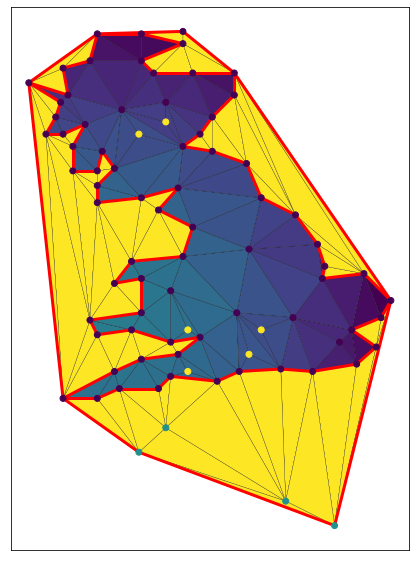

</image>

# EmeraldTriangles

This library provides transformations for 2d triangle meshes built on top
of
[scipy.spatial.Delaunay](https://docs.scipy.org/doc/scipy/reference/generated/scipy.spatial.Delaunay.html)
and [Triangle](https://rufat.be/triangle/):

  * Insert points (nodes) in an existing mesh, splitting any triangles
    that points fall into.
    * Meshes created this way might not be Delaunay, but any new
      connected set of triangles added will be Delaunay if viewed in
      isolation (without the pre-existing mesh).
  * Extend a mesh outwards to include new points.
    * The extension to the mesh will be a constrained delaunay.
  * Calculate the boundary polygon of a mesh.
  
This library uses a similar data structure to the Triangles library
above, but replaces numpy arrays with pandas dataframes, preserving
any extra columns across operations. It also contains a plotting
function similar to the one in the Triangle library, that supports
color attributes for vertices as well as triangle faces.

In addition, EmeraldTriangles provides import and export functionality
for

  * LandXML (import and export, no extra columns)
  * SQL (import and export, same supported databases as pandas)
  * [PyVista](https://docs.pyvista.org/) (Only export)
    * VTK (only export)

as well as some data transforms

  * Reprojection of coordinates using [pyproj](https://pyproj4.github.io/pyproj/stable/)
  * Spatial interpolation (Kriging) of data using [scikit-gstat](https://scikit-gstat.readthedocs.io/)
  * Sampling of data from a raster to triangulation vertices using [RasterIO](https://rasterio.readthedocs.io/en/latest/)
  * Sampling of data from a triangulation to new point locations (linear interpolation between vertices of the surrounding triangle)

# Documentation

Documentation is provided in the form of a [jupyter notebook with
example
usages](https://github.com/EMeraldGeo/EmeraldTriangles/blob/master/Example%20usage.ipynb)
as well as in docstrings accesible with the python help() function.

# Installation tips

Users have experience issues with using the `setup.py develop` option due to some strange behaviour from cython. Using `pip` instead seems to do this trick. 
